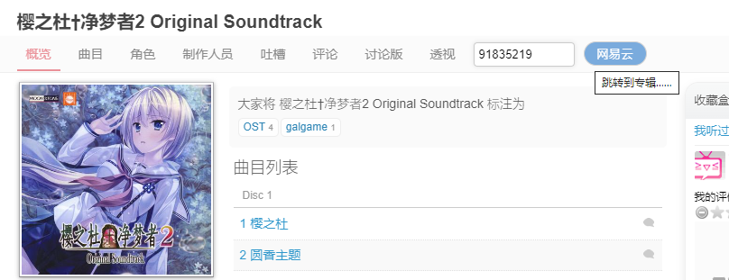

# bangumi-to-163music脚本说明



- 当未填写album id时，会尝试使用原声集的标题进行专辑搜索，并打开一个新页面返回结果。
- 填写album id后，会直接使用该id开打专辑页面，
并且每个原声集页面都会保存对应的album id到本地，方便下次直接打开专辑页面。

## 更新

### v.0.0.2

- 增加在设置页面增加“专辑”卡片，可以用于查看、编辑、导入、导出绑定的专辑关系；
- 提供一些测试数据，进行专辑绑定测试；
- 改进按钮、输入框，增强辅助功能和视觉效果。

## 测试数据

```js

4316,496123
5082,  2084828

7112, 2083839
 14636, 495466
21098, 2394097
    34369, 2085886
38736, 59450
39206, 2642728
  43385, 76460
46139, 71239
124156, 35114090
185788, 34746288
            315723, 89917102
328855,                 74828038
282967, 91835219

```
